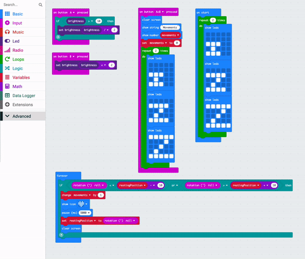

## Show some Zs

When the program starts, it is good to know that it is ready to start tracking.

In this step, you will display the zZs animation again when the program starts and use a function to organise your code.

### Re-using code

You can reuse the animation code.

--- task ---

Right-click on the <code style="background-color: #00AA00">repeat</code> block and click `Duplicate`.

--- /task ---

There will now be two <code style="background-color: #00AA00">repeat</code> blocks on the code editor panel. Each will contain three <code style="background-color: #1E90FF">show led</code> blocks

--- task ---

Put the duplicated <code style="background-color: #00AA00">repeat</code> block inside the <code style="background-color: #1E90FF">on start</code> block, under the <code style="background-color: #DC143C">set</code> block.

--- /task ---

### Tidy with a function

The animation is a large group of code blocks. 

Repeating a large group of blocks makes our code untidy.

If you need to re-use code, it is sometimes better to put it in a function and then 'call' the function to run. 

A function is a group of blocks that you can create and name. You can run those blocks by 'calling' the name of the function. Another word for a function is a subprogram, because it can be called to run from the main program.

--- task ---

Click the `Advanced` menu to reveal the Functions menu.

Click the Functions menu and then click `Make a Function`.

Name the function `zZ`.

--- /task ---

--- task ---

From the <code style="background-color: #D400D4">on button A+B</code> block, drag out the <code style="background-color: #00AA00">repeat</code> block.

Place it inside your new `function zZ` block.

--- /task ---

--- task ---

Delete the code inside the <code style="background-color: #1E90FF">on start</code> block.

--- /task ---

When a `call zZ` block is executed, it runs the code in the `function zZ`.

--- task ---

From the Advanced > Functions menu, drag out a `call zZ` block.

Place it inside the <code style="background-color: #1E90FF"> on start</code> block.

--- /task ---

--- task ---

Drag out another `call zZ` block.

Place it inside the <code style="background-color: #D400D4">on button A+B</code> block, under the <code style="background-color: #DC143C">set movements</code> block.

--- /task ---

Here are the blocks that have changed in this step:

<iframe style="position:relative;top:0;left:0;width:100%;height:100%;" src="https://makecode.microbit.org/---codeembed#pub:_Exxaiz8UhErD" allowfullscreen="allowfullscreen" frameborder="0" sandbox="allow-scripts allow-same-origin"></iframe>

--- task ---

**Test** your program: 

+ Check that your zZ animation plays when the simulator starts
+ Check that your zZ animation also plays when the `A+B` button is pressed (after the number of movements is displayed)

--- /task ---

--- task ---

[[[download-to-microbit]]]

--- /task ---
