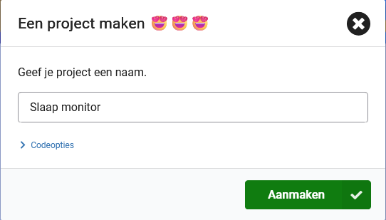

## Bijhouden en weergeven

### MakeCode openen

Om je micro:bit-project te maken, moet je eerst de MakeCode-editor openen.

--- task ---

Open de MakeCode editor in [makecode.microbit.org](https://makecode.microbit.org){:target="_blank"}

--- collapse ---

---
title: Offline versie van de editor
---

Er is ook een [downloadbare versie van de MakeCode editor](https://makecode.microbit.org/offline-app){:target="_blank"}.

--- /collapse ---

--- /task ---

### Is dit je eerste micro:bit-project?

[[[makecode-tour]]]

### Maak je project

Zodra de editor is geopend, moet je een nieuw project aanmaken en je project een naam geven.

--- task ---

Klik op de knop **Nieuw project**.


--- /task ---

--- task ---

Geef je nieuwe project de naam `Slaap monitor` en klik op **Aanmaken**.



**Tip:** Om het makkelijker te maken om je project later terug te vinden, geef je het een logische naam die gerelateerd is aan de activiteit die je aan doen bent.

--- /task ---

<div style="display: flex; flex-wrap: wrap">
<div style="flex-basis: 200px; flex-grow: 1; margin-right: 15px;">
In deze stap programmeer je de micro:bit om te detecteren of hij beweegt en de LED's te laten oplichten als dat gebeurt.
</div>
<div>


</div>
</div>

De micro:bit gebruikt een sensor genaamd een versnellingsmeter om te zien wanneer deze is gekanteld.

<p style="border-left: solid; border-width:10px; border-color: #0faeb0; background-color: aliceblue; padding: 10px;">

<span style="color: #0faeb0">Versnellingsmeters</span> worden op veel apparaten gebruikt. Ze kunnen waarnemen of we bewegen, zoals wanneer je rent of springt, en ze helpen onze tablets en smartphones te bepalen op welke manier ze worden vastgehouden. Deze slimme sensoren maken games leuker, omdat je kunt bepalen hoe een personage beweegt door een controller te kantelen.

</p>

### Draaien

Je moet zien **of** de micro:bit naar rechts **of** naar links is gedraaid.

Als dit gebeurt, ga je ervan uit dat er beweging is geweest tijdens de slaap.

--- task ---

Vanuit het `Logisch`{:class="microbitlogic"} menu, sleep je een `als`{:class="microbitlogic"} blok en plaats het in het `de hele tijd`{:class="microbitbasic"} blok.


--- /task ---

--- task ---

Open het `Logisch`{:class='microbitlogic'} menu opnieuw en pak een `of`{:class='microbitlogic'} blok.


Plaats het in het `waar` gedeelte van het `als`{:class='microbitlogic'} blok.

```microbit
basic.forever(function () {
    if (false || false) {

    }
})
```

--- /task ---

Nu moet je de **twee** voorwaarden aan weerszijden van de **of** toevoegen.

Dit betekent dat de code in je `als`{:class='microbitlogic'} blok wordt uitgevoerd als **aan een van beide** voorwaarden wordt voldaan.

--- task ---

Sleep vanuit het menu `Logisch`{:class='microbitlogic'} het vergelijkingsblok `0 < 0`{:class='microbitlogic'}.

Plaats het aan de linkerkant van het `of`{:class='microbitlogic'} blok.

```microbit
basic.forever(function () {
    if (0 < 0 || false) {

    }
})
```

--- /task ---

--- task ---

Sleep vanuit het menu `Invoer...meer`{:class='microbitinput'} een `rotatie`{:class='microbitinput'} blok.


Plaats het in de eerste `0` van het `0 < 0`{:class='microbitlogic'} vergelijkingsblok.

--- /task ---

--- task ---

Gebruik het vervolgkeuzemenu om `kantelen`{:class='microbitinput'} te wijzigen in `draaien`{:class='microbitinput'}.

--- /task ---

--- task ---

Verander de `0` naar `-10`. Hiermee wordt gecontroleerd of de micro:bit 10° naar **links** is gedraaid.

--- /task ---

Je code zou er als volgt uit moeten zien:

```microbit
basic.forever(function () {
    if (input.rotation(Rotation.Roll) < -10 || false) {

    }
})
```

--- task ---

**Fouten oplossen (Debuggen)**

Controleer of je:

+ Geklikt hebt op het menu Invoer **meer**, niet op het normale menu Invoer
+ De tweede waarde hebt veranderd van `0` naar **`-10`**, niet `10`

--- /task ---

--- task ---

Klik met de rechtermuisknop op het vergelijkingsblok `<`{:class='microbitlogic'} en selecteer **Dupliceren**.

--- /task ---

Je hebt nu twee vergelijkingsblokken.

--- task ---

Sleep het gedupliceerde vergelijkingsblok naar de rechterkant van het `of`{:class='microbitlogic'} blok.

--- /task ---

--- task ---

Gebruik het vervolgkeuzemenu om het kleiner dan-symbool (`<`{:class='microbitlogic'}) te wijzigen in een groter dan-symbool (`>`{:class='microbitlogic'}).

--- /task ---

--- task ---

Verander de `-10` naar `10`. Hiermee wordt gecontroleerd of de micro:bit 10° naar **rechts** is gedraaid.


--- /task ---

### Houd het aantal bij

Wanneer aan een van beide voorwaarden is voldaan, is de micro:bit naar links of rechts gedraaid.

Je moet:
+ Het aantal slaapbewegingen bijhouden
+ De LED's verlichten

Om het aantal slaapbewegingen bij te houden, gebruik je een variabele.

--- task ---

Open het `Variabelen`{:class="microbitvariables"} menu en klik op **Maak een variabele**.


--- /task ---

--- task ---

Noem je nieuwe variabele `bewegingen`.


--- /task ---

Elke keer dat er een beweging wordt gedetecteerd, verhoog je de waarde van de variabele `bewegingen` met `1`.

--- task ---

Sleep vanuit het menu `Variabelen`{:class="microbitvariables"} een blok `verander bewegingen met`{:class="microbitvariables"}.


--- /task ---

--- task ---

Plaats het in het `als`{:class="microbitlogic"} blok.

```microbit
let movements = 0
basic.forever(function () {
    if (input.rotation(Rotation.Roll) < -10 || input.rotation(Rotation.Roll) > 10) {
        movements += 1
    }
})
```

--- /task ---

### De LED's verlichten

Je kunt de LED's op de micro:bit gebruiken om te laten zien dat er een beweging heeft plaatsgevonden.

Dit helpt je om je project te testen.

--- task ---

Sleep vanuit het menu `Basis`{:class="microbitbasic"} het blok `toon pictogram`{:class="microbitbasic"}.


--- /task ---

--- task ---

Plaats het onder het blok `verander bewegingen met`{:class='microbitvariables'}.

--- /task ---

--- task ---

Sleep vanuit het menu `Basis`{:class="microbitbasic"} het blok `pauzeer (ms)`{:class="microbitbasic"}.

Plaats het onder het `toon pictogram`{:class='microbitbasic'} blok.

--- /task ---

--- task ---

Sleep vanuit het menu `Basis`{:class="microbitbasic"} het blok `wis scherm`{:class="microbitbasic"}.

Plaats het onder het blok `pauzeer (ms)`{:class='microbitbasic'}.

Je code zou er als volgt uit moeten zien:

```microbit
let movements = 0
basic.forever(function () {
    if (input.rotation(Rotation.Roll) < -10 || input.rotation(Rotation.Roll) > 10) {
        movements += 1
        basic.showIcon(IconNames.Heart)
        basic.pause(100)
        basic.clearScreen()
    }
})
```

--- /task ---

--- task ---

**Test je programma**

Als je een wijziging aanbrengt in een codeblok in het bewerkingspaneel zal de simulator opnieuw starten.

+ Beweeg over de rechter- of linkerkant van de micro:bit

De LED's zullen oplichten en een hartpictogram tonen.

+ Stap eventjes weg van de micro:bit

De LED's blijven knipperen totdat de micro:bit weer waterpas staat.

--- /task ---

Vervolgens ga je verschillende rustposities instellen, omdat het zelden voorkomt dat iemand de hele nacht in een perfect vlakke positie slaapt!
